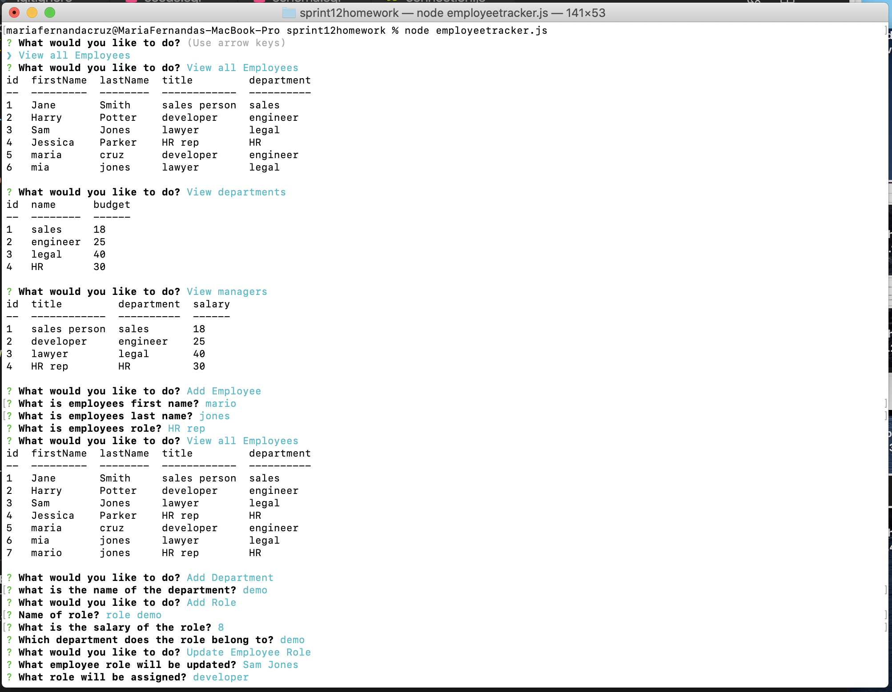
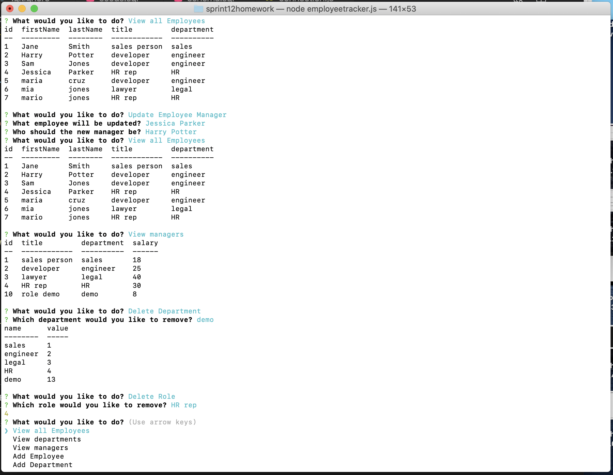

# Employee Tracker

Application can be used to make it easy to keep track of roles, departments, and employees. User can choose from a variety of functions such as: viewing employees, departments, and roles, adding employee, roles, and departments, as well as deleting department and role.

## Instructions

Using the arrows user will select the function they would like to use, and depending on the choice the user will be prompted questions that will complete the selection of choice.

